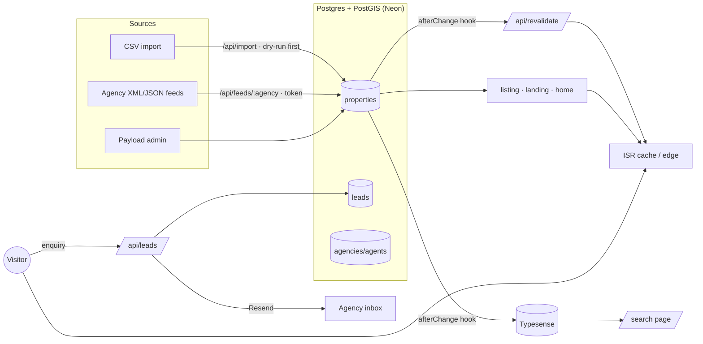
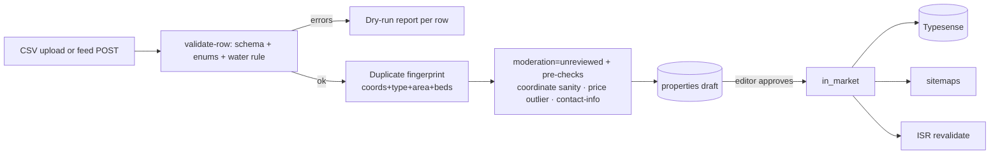

# WATERLINE — Architecture

One Next.js 15 App Router application with Payload 3 embedded. Public pages
are SSG/ISR; the backoffice and APIs are server-rendered. Everything that
reads listings goes through `/src/lib/db` (CLAUDE.md rule 2); everything a
visitor sees passes the §6.6 sanitizer before it leaves the server.

## Data flow

Key invariants:
- **The water rule** (`>=1 waterAccessType`, `distanceToWaterM <= 50`) is a
  `beforeValidate` hook on Property — nothing publishes without it.
- **Tenancy**: one `tenant()` access function; every listing/lead query is
  agency-scoped (verified by `tests/int/tenancy.int.spec.ts`).
- **Sanitizer parity**: the public API and the Typesense documents run
  through the same `sanitizePropertyForPublic` — jittered coordinates and
  hidden fields hold on both read paths.

## Import pipeline

Feeds poll every 6h (`/api/cron/poll-feeds`); listings missing from two
consecutive runs are withdrawn. Import job files purge after 90 days
(`/api/cron/retention`).

## Search sync

- Writer: Property `afterChange` upserts/deletes the Typesense document —
  only publicly-indexable listings ever reach the index.
- Reader: `/search` queries Typesense; on failure it falls back to the same
  filters against Postgres (`searchPropertiesPostgres`) — one `SearchResult`
  contract, `engine` field tells you which answered.
- Full rebuild: `pnpm search:reindex` (blue/green: builds a new collection,
  swaps the alias — see runbooks/search-index.md).

## Caching

| Layer | What | TTL |
|---|---|---|
| Edge (Vercel) | listing HTML `s-maxage=600`, landing 3600, destination 900, journal 3600, all `stale-while-revalidate=86400` | headers in next.config |
| ISR | the same routes re-render in the background per `revalidate` exports | 600–3600 s |
| Purge | Payload `afterChange` → signed `/api/revalidate` (timing-safe secret) expands paths across locales | seconds |
| Immutable | `/_next/static/*` hashed assets | 1 year |
| In-process | Payload client memo + 15 s fail-fast cooldown; middleware 410/301 lookup memo 5 min | per instance |

## Error & analytics paths

Unhandled server errors → `src/instrumentation.ts` → PII scrub
(`lib/security/sentry`) → stderr + Sentry envelope when `SENTRY_DSN` set.
Client analytics → typed events (`lib/analytics`) → Plausible, loaded only
after the `wl_consent` cookie grants analytics.
